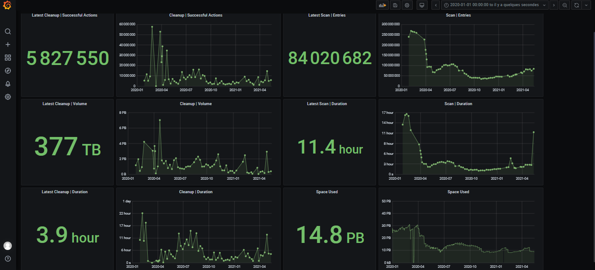

# Robinhood to Influxdb

## Purpose 

Simply parse generated [robinhood](https://github.com/cea-hpc/robinhood) logs files and push it to an influxdb sgbd.

Link to a Grafana frontend, you can create a dashboard like that.

